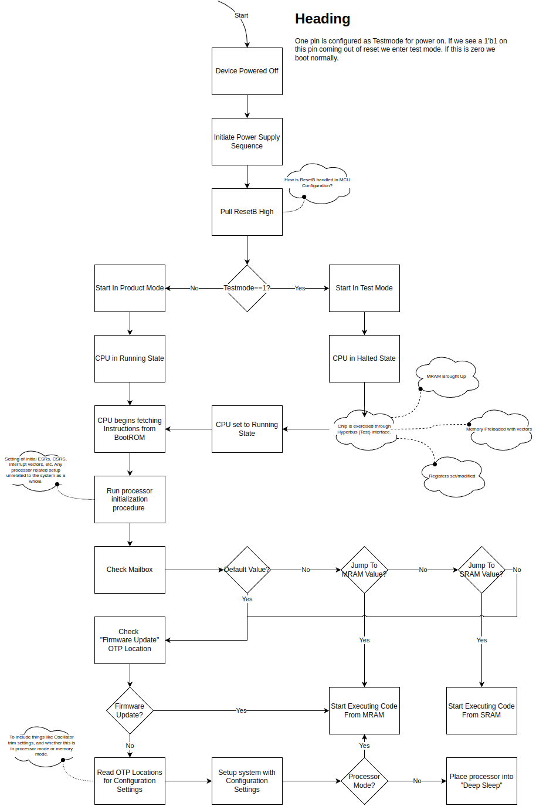

# Bring up sequence.

## First boot on the tester.
* TestMode pin is held high. CPU is halted (in reset mode?)
* POR is toggled.
* OSC_CLK_OUT is measured, the PPM difference from expected frequency is calculated.
* Osc TRIM Parameters are calculated. (Index in Trim table?)
* Part is speed graded.
* Osc TRIM parameters and speed grade is written to OTP

## Second Boot.
* TestMode is held low.
* CPU Starts executing bootrom code.
	* OTP is read(Trim Param, Speed grade, ROM Update).
	* If ROM Update bit set, jump to updated firmware in MRAM.
	* Trim Ring Oscillator.
	* Program RO-CLK Div for highest clk freq supported by device speed grade.
	* Calculate  Clk Div for Periph and MRAM.
	* Program Periph clkdiv and mram clkdiv.
	* Read CHIPMODE.bootloader register to determine location of application code (TCM,MRAM(default))
	* Jump to application code.

## Program Mode
* Bring MRAM out of deep sleep.
* Load MRAM/TCM with the application code
* Set CHIPMODE.bootloader register.

## Application Code

* If MRAM is in deep sleep mode it needs to be brought out of sleep.
	* Write to `system_registers.PowerDomainReq.mram_dsleep_en` to bring MRAM out of deep sleep.
* Use `system_registers.Mailbox0.mbox0` and `system_registers.Mailbox1.mbox1` for communication from CPU to host chip and vice versa.

