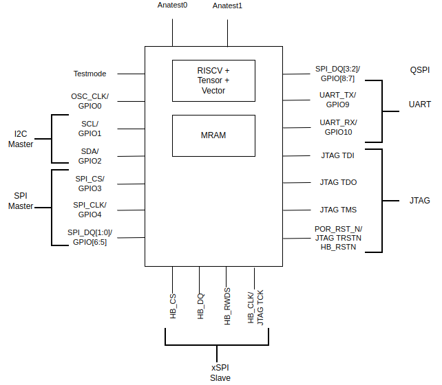

# Overview

Erbium is 
* 8C,16T RISC-V Core, ISA(RV64IMFC_Zicsr_Zifencei +Tensor, +Vector +Atomic)
* I2C and QSPI Controllers
* xSPI and UART Target interfaces
* 16MB MRAM (L2) with 16KB of OTP region with 12KB of user usable OTP's
* Multiple Boot Options
	* Boot from Bootrom.
	* Boot from MRAM. (via OTP setting)
	* Boot from SRAM (in test mode)

\Begin{multicols}{2}

## Features
* External Interfaces
	* JTAG
	* UART
	* xSPI Target,
	* I2C Controller
	* (Q)SPI Controller
	* 11 GPIO
	* Chiplet Interfaces
		* AHB
		* AXI

### xSPI Interface

* JESD251C and JESD216H compliant
* Supports
	* 1S-1S-1S
	* 4S-4D-4D
	* 4D-4D-4D
	* 8S-8S-8S
	* 8D-8D-8D (Octal)
	* 8D-8D-8D (Hyperbus)
* Operating frequency 200 Mhz
* 64 bit register and memory access 
* Linear Burst capable.

### Chiplet Interface

* 2 Interfaces AXI, AHB
* AXI and AHB in 32bit and 64 bit variants.
* Chiplet interface is not available in testchip tapeouts.

**Note:** While the chiplet interface is a part of the design it is not available(optimised away during PD) in testchips. i.e. erbium will not have the chiplet interface.
	
### CPU Subsystem
* ET\-Minion
	* RV64IMFC \+ Zicsr \+ Zifencei
	* In\-Order execution with 2 Hardware Threads
* 8 ET\-Minions
* L1 Instruction cache
  * Shared among the 8 ET\-Minions
  * 128 sets\, 4 way \(set associative\)
  * 64Byte cache line
* L0 Micro Instruction cache
  * Shared among 4 ET\-Minions
  * 1 set\, 16 ways \(fully associative\)
* Cooperative Tensor Load
  * Coalesces multiple Tensor Load requests to the same memory location \(from different minions\) into a single request to provide better performance and power\.

* L1 Data Cache \(  __L1D$__  \) \- 4KB configurable
  * 16 sets\, 4 ways\, 64 Bytes cache line
  * Non\-coherent
  * Configuration through mcache\_control CSR
  * Configurable   __modes__  :
	  * Shared(4KB)
	  * Split (2K Each)
	  * Scratchpad (3K Scratchpad, 512B Split)
* Vector Processing Unit \(  __VPU__  \)
  * 8 lanes\, 32 bits per lane
  * 1 FMA unit\, 2 IMA unit\, 1 INT unit\, 1 TRANS unit
  * Extends the RISC\-V FP registers from 32b to 256b
  * Each FP register is like a vector with   __8__   elements of   __32b__   each
  * Related   __custom extensions__  :
    * Packed Single \( __PS__ \) --> FP32\, memory and compute operations
    * Packed Integer \( __PI__ \) --> Int32/uInt32\, compute operations
    * Atomic \( __AMO__ \) --> PS and PI AMO operations
    * __Tensor__  --> Memory\, FMA32\, FMA16A32\, IMA8A32\, QUANT\, REDUCE operations

\End{multicols}
