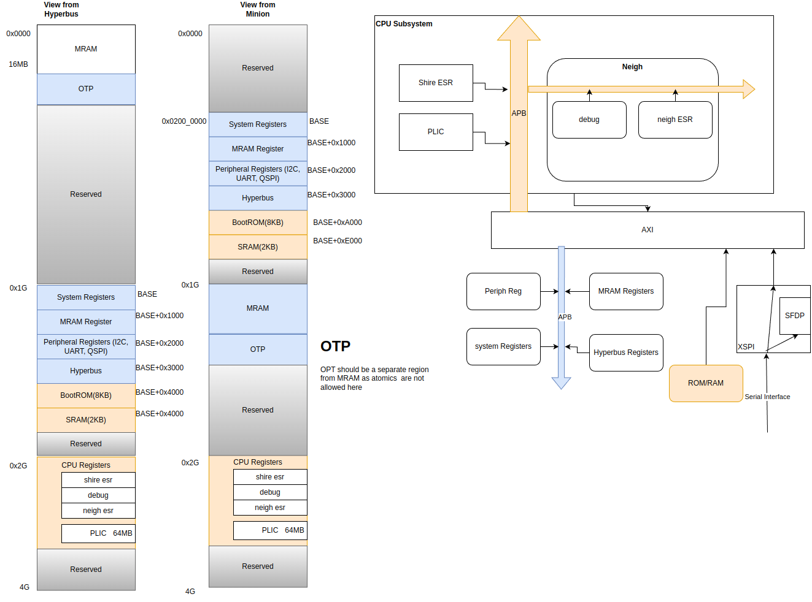

# Memory Map

| Interface     | Type     |
| ---           | ---      |
| CPU_SUBSYSTEM | AXI      |
| CPU_SUBSYSTEM | APB      |
| xSPI Data     | AXI      |
| xSPI Cfg      | APB      |
| I2C           | AXI4Lite |
| QSPI          | AXI4     |

## Interconnect: Transaction Initiators and Targets

There are 3 Major Transaction Initiators in the System.

1. Hyperbus
2. CPU
3. Chiplet Interface(Not present in Erbium).

| Initiator | Interface | Targets Accessible                                                                                            |
| --        | --        | --------                                                                                                      |
| Hyperbus  | AXI4      | MRAM, SRAM, System Registers, Peripheral Registers,  HyperBusRegisters,  CPURegisters, MRAMRegisters          |
| CPU       | AHB-Lite  | MRAM, SRAM, Bootrom, System Registers, Peripheral Registers,  HyperBusRegisters,  CPURegisters, MRAMRegisters |
| Chiplet   | AXI4      | MRAM,  SystemRegisters                                                                                        |

This device can be used as either an Edge AI device or as a simple Flash replacement. The memory Map seen by CPU and UART (Edge AI Mode) is different than the memory map seen by xSPI( Flash replacement device)

## CPU and UART Memory Map.

| Target           | Protocol at NIC | Data Width   | Start Address | Size        |
| ---              | ---             | --- | ---           | ---         |
| SystemRegister   | APB4            | 32           | 0x0200_0000   | 0x1000      |
| MRAMRegister     | APB4            | 64           | 0x0200_1000   | 0x1000      |
| PeriphRegister   | APB4            | 32           | 0x0200_2000   | 0x1000      |
| HyperbusRegister | APB4            | 32           | 0x0200_3000   | 0x1000      |
| Bootrom          | AXI4            | 64           | 0x0200_A000   | 0x2000      |
| SRAM             | AXI4            | 64           | 0x0200_E000   | 0x0800      |
| MRAM + OTP       | AXI4            | 512          | 0x4000_0000   | 0x4000_0000 |
| CPURegisters     | APB4            | 32           | 0x8000_0000   | 0x4000_0000 |

## Hyperbus Memory Map.

Customers accessing Erbium through xSPI interface are expected to use it as a MRAM Memory device. In such a case it is natural to assume the memory starts from address 0. Hence in Hyperbus case the addressmap is rearranged to facilitate this world view.

| Target              | Protocol at NIC | Data Width | Start Address | Size        |
| ----                | ---             | ---        | ---           | ---         |
| MRAM + OTP          | AXI4            | 512        | 0x0000_0000   | 0x4000_0000 |
| System Register     | APB4            | 32         | 0x4200_0000   | 0x1000      |
| MRAM Register       | APB4            | 64         | 0x4200_1000   | 0x1000      |
| Peripheral Register | APB4            | 32         | 0x4200_2000   | 0x1000      |
| Hyperbus Register   | APB4            | 32         | 0x4200_3000   | 0x1000      |
| Bootrom             | AXI4            | 64         | 0x4200_A000   | 0x2000      |
| SRAM                | AXI4            | 64         | 0x4200_E000   | 0x0800      |
| CPU Registers       | APB4            | 64         | 0x8000_0000   | 0x4000_0000 |

**Note** All Register address spaces are 64 bit aligned.
