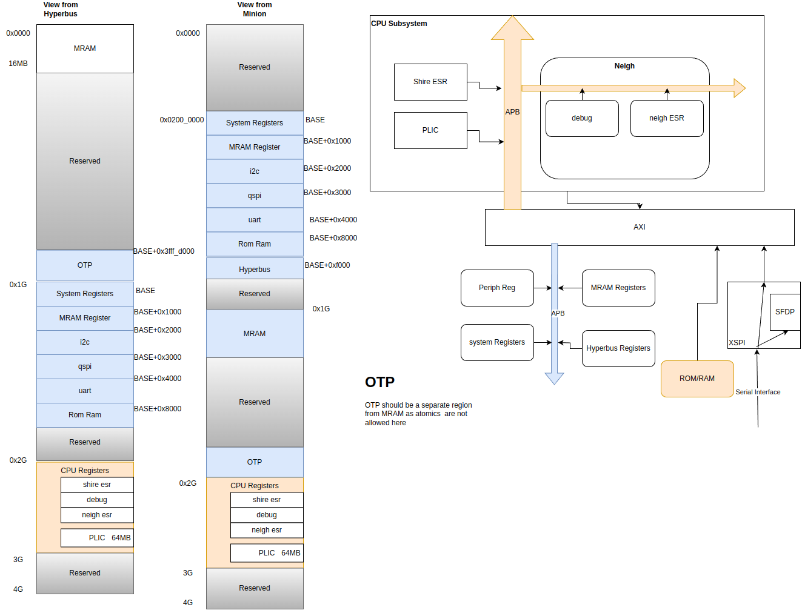

# Memory Map

| Interface     | Type     |
| ---           | ---      |
| CPU_SUBSYSTEM | AXI      |
| CPU_SUBSYSTEM | APB      |
| xSPI          | AXI      |
| xSPI          | APB      |
| I2C           | AXI4Lite |
| QSPI          | AXI4     |

## Interconnect: Transaction Initiators and Targets

There are 3 Major Transaction Initiators in the System.

1. xSPI
2. CPU
3. UART

| Initiator | Interface | Targets Accessible                                                                                            |
| --        | --        | --------                                                                                                      |
| xSPI      | AXI4      | MRAM, SRAM, System Registers, Peripheral Registers,  XSPI Registers,  CPURegisters, MRAMRegisters             |
| CPU       | AHB-Lite  | MRAM, SRAM, Bootrom, System Registers, Peripheral Registers,  XSPI Registers,  CPURegisters, MRAMRegisters    |
| UART      | AXI4      | MRAM, SRAM, Bootrom, System Registers, Peripheral Registers,  XSPI Registers,  CPURegisters, MRAMRegisters    |

This device can be used as either an Edge AI device or as a simple Flash replacement. The memory Map seen by CPU and UART (Edge AI Mode) is different than the memory map seen by xSPI( Flash replacement device)

## CPU and UART Memory Map.

  | Offset     | Identifier       | Name                            |
  |------------|------------------|---------------------------------|
  | 0x02000000 | system_registers | System Registers                |
  | 0x02001000 | mram_registers   | AXI-to-MRAM Bridge Register Map |
  | 0x02002000 | i2c_registers    | —                               |
  | 0x02003000 | qspi_registers   | QSPI Registers                  |
  | 0x02004000 | uart_registers   | UART Registers                  |
  | 0x02008000 | ROMRAM           | —                               |
  | 0x0200F000 | xspi_registers   | sccr                            |
  | 0x40000000 | mram             | MRAM                            |
  | 0x80000000 | cpu_registers    | ESR Map of Erbium               |
  | 0xA0000000 | plic             | —                               |
  | 0xFE000000 | nic_config       | —                               |

## xSPI Memory Map.

Customers accessing Erbium through xSPI interface are expected to use it as a MRAM Memory device. In such a case it is natural to assume the memory starts from address 0. Hence in Hyperbus case the addressmap is rearranged to facilitate this world view.

| Offset     | Identifier       | Name                            |
|------------|------------------|---------------------------------|
| 0x00000000 | mram             | MRAM                            |
| 0x40000000 | system_registers | System Registers                |
| 0x40001000 | mram_registers   | AXI-to-MRAM Bridge Register Map |
| 0x40002000 | i2c_registers    | —                               |
| 0x40003000 | qspi_registers   | QSPI Registers                  |
| 0x40004000 | uart_registers   | UART Registers                  |
| 0x40008000 | ROMRAM           | —                               |
| 0x80000000 | cpu_registers    | ESR Map of Erbium               |
| 0xA0000000 | plic             | —                               |
| 0xFE000000 | nic_config       | —                               |

**Note** All Register address spaces are 64 bit aligned.
