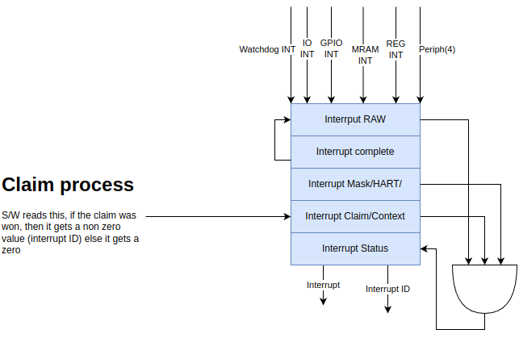

# Interrupts

There are two sets of interrupts, Timer and S/W interrupts are described in the minion specification.

This chapter describes the system Interrupts.

The system Interrupts are generated from the following endpoints

* MRAM Interrupt: Raised by MRAM on ECC failure, to trigger a wellness check
* GPIO Interrupt: Raised by the GPIO module when any of the input signal changes state.
* Register Interrupt: A specific bit in the system register that can be written to to trigger an interrupt,e.g. this can be used by xSPI to interrupt the CPU and process the mailbox.
* Periph Interrupt: These interrupts are generated by QSPI,UART, I2C and xSPI Hardware to indicate state changes like TxDone, RxDone, FIFO under/over flow etc.

 
## CPU Handling of system interrupts

* The system interrupt hardware follow the RISC-V PLIC architecture. The CPU handles the interrupts in Machine mode.
* PLIC MMIO Space consists of the following registers

| Register | Count                 | Purpose                                                                                                                              |
| ---      | ----                  | -----------                                                                                                                          |
| Pending  | 1bit/interrupt source | Set when source generates an interrupt. input could be level or pulse. Output is level                                               |
| Mask     | 1 Reg/HART            | The Pending register is Anded with the mask and the result is or'ed and sent to the external interrupt pin of the corresponding core |
| Claim    | 1 Reg/HART            | A read from this register returns the highest priority interrupt id available for this endpoint.                                     |
| Complete | 1bit/interrupt source | Write of interruptid to this register clears the corresponding interrupt                                                             |
| Priority | 2bit/interrupt source | Sets the priority for the interrupt                                                                                                  |

## Interrupt handling process.

This is a short overview. Refer to the RISCV privileged ISA for details

* A interrupt from a peripheral sets the corresponding bit in the Pending Register.
* This is ANDed with the per HART mask register and added to the interrupt queue of the HART.
* If the Queue is not empty interrupt signal is sent to to minion.
* If we want to pin down a specific interrupt to a specific minion, we will have to clear its mask bit in all other minions mask registers.
* Multiple interrupts can be outstanding at any given time.
* Each HART that received the interrupt will attempt to read its Claim register. There is one Claim register per HART.
* The PLIC will:
	* Check what is the highest outstanding interrupt in the Queue for this HART and return its ID during the claim read.
	* Remove this interrupt from the Queue of other HART's
* After servicing the interrupt the minion will write to the Complete register. On Write the PLIC will clear the Pending bit.
