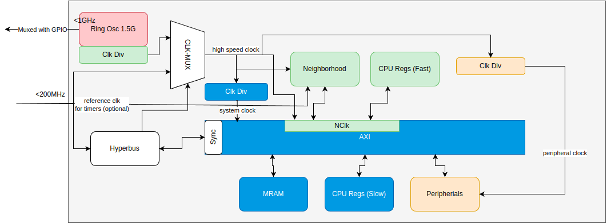
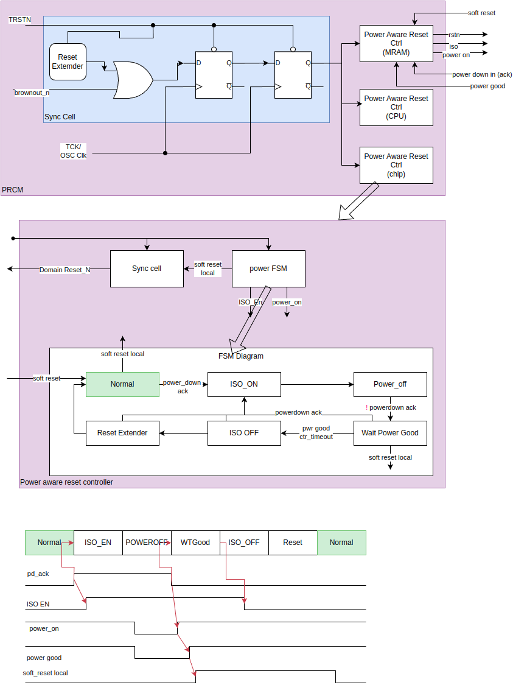
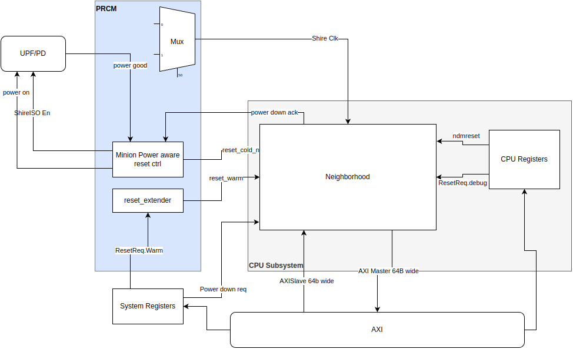

# Power Reset & Clock  Management.

## Clock and reset signals.

## System Clocks

There are dedicated clock and reset signals for each interface

| Interface | Clock      | Reset            | Note                        |
| ---       | ----       | -----            | -----                       |
| Chiplet   | HCLK\_ACLK | HRESETn\_ARESETn | Active low Reset, Tied High |
| Hyperbus  | HB_CLK     | HB_RSTN          | Active low Reset            |
| Internal  | OSC_CLK    |                  | Internal Ring Oscillator    |

**Note** In Erbium the Chiplet domain is not available and only hyperbus reset is used to reset the system.

## OSC Clock
* This is a high speed clock generated internally from a ring oscillator.
* The raw ring oscillator(RO) frequency is process dependent and can vary by a few hundred MHz from the designed frequency.
* The first level clock divider is programmed to divide the output of the RO by 20 resulting in a <75MHz boot clock.
* The tester measures the RO frequency, and process variation and writes it to the OTP. This is used to
	* Trim the RO to generate a 1GHz clock.
	* Program the clock divider to provide the required highspeed CPU Clock.
	* Clock dividers can be reprogrammed later as per the system load.
* MRAM and rest of the system operates at a 200MHz clock. A second clock divider divides the `high speed clock` to generate the `system clock`
* Serial protocols require a clock programmed to N times the required baud rate. The Peripheral clock is used as this sampling clock.

## Hyperbus Clock
* This is an external clock with frequency upto 200MHz.
* If required a bit in the hyperbus register can be written to, to make this the system clock.

## Shire External Resets

| Reset                          | Description                                      | Register Programming               |
| ---                            | ------                                           | ---                                |
| reset_cold                     | Power on reset                                   |                                    |
| reset_warm                     | Retains state: Does not reset ESR, VC FIFOs etc. | SoftReset.cpu_warm_reset = 0       |
| dmctrl.ndmreset                | Resets all non-debug logic                       | Handled by CPU Registers           |
| bpam_run_control.gpio.ndmreset | Internal to Shire                                |                                    |
| dmctrl.dmactive                | debug logic reset.                               | Handled by CPU Registers           |

## Power Domains.

The device contains the following power domains.
* Always On.
* System Domain.
* CPU Subsystem Domain.
* Per Minion Power Domain.
* MRAM Digital Domain
* Each Memory (Bootrom, SRAM and MRAM) has its own power domains.
* Each powerdomain is controlled via a power switch.
* At Boot every Digital Domain powerswitch is turned on.
* The boot routine will check the OTP register for domains that need to be powered down after boot and write to the corresponding system_registers.PowerDownReq bits.
## Valid Power State

### Simple Power States
| State                               | Sys PS          | MRAM Digital PS | MRAM PS        | cpu subsystem PS | ROM/ SRAM PS | minion PS[7:0]  | Notes                                            |
| ----                                | :---:           | ---             | ---            | ---              | ---          | ---             | ----                                             |
| All On                              | On              | On              | On             | On               | On           | On              |                                                  |
| System Off                          | Off             | Off             | Off            | Off              | Off          | Off             | Extreme low power. Toggle TMS to wake the device |
| CPU Off                             | On              | X               | X              | Off              | X            | Off             |                                                  |
| MRAM Off                            | On              | Off             | Off            | X                | X            | X               |                                                  |
| 1-8 Minions Off                     | On              | X               | X              | On               | On           | On/Off          |                                                  |
| Controlling PowerDomainReq register | system poweroff | mram pd         | mram dsleep en | cpu pd           | sram pd      | minion pd_[0-7] |                                                  |

**Note:**
* X: Dont care. The domain is usually on. But can be off if a complex Power State is used.
* Other than the system off state all other power switches can be turned on by clearing the corresponding pd_req bit.
* Complex Power States are:
	* CPU OFF + MRAM OFF
	* Minion_x OFF + MRAM OFF

## Power State Controller FSM.

* At boot the FSM is in normal state.
* Writing to pd_req initiates the power down sequence.
* The corresponding domain is informed about the request.
* The domain completes the current outstanding transaction and frees up the system bus and goes into a halt state.
* Domain generates the PD ack signal.
* PD ack signal triggers the Power State Controller which executes the following state changes:
	* ISO_EN State: drives the isolation enable signal to the isolation cells placed on the output wires of the power domain.
	* POWEROFF State: turns off the power switch and remains in this state until pd req goes low, This can be due to:
		* Toggling of TMS signal in case of system power off
		* Clearing the corresponding PD Register bit.
	* When the pd req goes low this state turns on the power switch and transitions to WTGood State.
	* WTGOOD State: It takes some time to ramp up the voltage from 0 to VDD. In this state:
		* A counter is initialized with the system_registers.PowerGood.counter register value and counts down to zero.
		* State changes to ISO_OFF when the counter is zero.
		* soft_reset_req is asserted and stays asserted until we enter the NORMAL state.
	* ISO_OFF: the isolation enable signal to the isolation cells is deasserted.
		* Note: It is expected the reset values of the domain output signals do not initiate or accept any transaction. 	
	* RESET: We stay in this state for the number of cycles required to propagate the reset to all sub modules in the power domain. 
	* NORMAL: Normal operation resumes.
